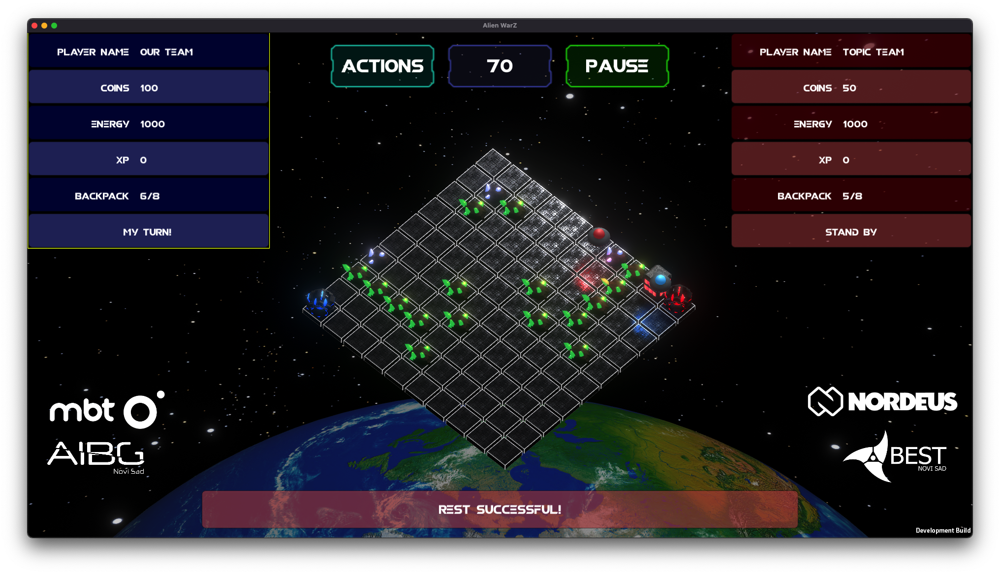

# Alien Resource Wars AI Challenge

This document outlines our solution for creating a bot that can strategically outmaneuver opponents and achieve victory.

## Goal

The goal of this hackathon is to develop an AI bot that can strategically win the game by efficiently gathering resources, managing energy, and making tactical decisions against opponent bots.

## Rules

### Objective
Your AI bot, representing an alien, will start its mission from one end of a quadrilateral neon field, exiting from its space station. The field contains various resources - diamonds and minerals. The goal is to collect and transport as many resources as possible back to your base, earning experience points (XP).

### Actions per Turn
Each turn, your AI bot can perform the following actions:

1. **Movement:** Traverse the neon field by moving vertically or horizontally a certain number of spaces, avoiding occupied spots. Your bot can stop at its base.
2. **Resource Gathering:** Mine minerals or diamonds and store them in the bot's backpack to maximize the haul.
3. **Factory Construction:** Place auxiliary factories on empty spaces to facilitate resource transfer.
4. **Factory Attack:** Launch attacks on the opponent’s factories to eliminate competition and strengthen control. Note: This can only be done if the opponent’s bot is not guarding their factory.
5. **Resource Conversion:** Convert gathered resources into energy, experience, or coins at your space station. This can only be done if the bot has resources to convert and is at the base.
6. **Resource Refining:** Improve the quality of resources through refining processes in factories. This can only be done if the bot has resources to refine.
7. **Special Gadgets Purchase:** Acquire unique gadgets from the shop (details below) to gain strategic advantages.
8. **Rest:** Replenish energy to maintain peak performance.

### Energy Management
Your AI bot must manage its energy reserves carefully. Moving and gathering resources deplete finite energy supplies. If the bot runs out of energy, defeat is inevitable. 

### Resources and Stats
Check the accompanying table for detailed statistics on resource loads, costs, credits, and the values, XP, and energy gained in the base.

| Resource     | Cost      | Weight/Capacity | Digging Streak | Processing Time | Recovery Time | Value    | XP  | Energy |
|--------------|-----------|-----------------|----------------|-----------------|---------------|----------|-----|--------|
| Minerals     | -         | 2 raw / 1 refined | 6              | 5 turns         | 30 turns      | 15 coins | 10  | 250E   |
| Diamonds     | -         | 5 raw / 3 refined | 3              | 11 turns        | 60 turns      | 50 coins | 25  | 100E   |
| Factory      | 50 coins  | -               | -              | -               | -             | 75 (destroy) | 75 (destroy) | -  |

The maximum energy that can be accumulated is 1000, and coins are also capped at 1000. If either of these limits is exceeded, no invalid moves occur, but the value remains at 1000.

### Factory Destruction
Factories are destroyed after three attacks, each attack costing 100 energy.

### Shop
*Note: Moves are cumulative. If a Freeze is purchased while one is active, the number of frozen turns adds up.*

| Name             | Description                                                                               | Cost       |
|------------------|-------------------------------------------------------------------------------------------|------------|
| Freeze           | Freeze the opponent for 3 turns                                                           | 200 coins  |
| Backpack Increase| Increase backpack capacity from 8 to 16 cubic units for 20 turns.                         | 175 coins  |
| Daze             | Reverse opponent's movements for the next 3 turns.                                        | 10 coins   |

### Energy Costs per Action
| Action           | Energy Cost              |
|------------------|--------------------------|
| Landing (start)  | 1000E                    |
| Digging          | -5E for minerals / -6E for diamonds |
| Movement         | -1E * steps * min(1 + backpack weight, 8) |
| Attack           | -100E                    |
| Rest             | +20E                     |

### Game End
The game ends if the bot runs out of energy. A penalty of 250 energy is imposed for any invalid move, which includes any command outside the allowed actions and any move that breaks the game's logic. The game also ends after 250 turns.

### Determining the Winner
Winners are determined in the following order:
1. XP
2. Coins
3. Energy
4. Number of factories
5. Backpack weight

## AI Bot Development

### Requirements
1. **Programming Language:** Use any programming language that can interact with the game API.
2. **Game API:** The game provides an API for interacting with the game environment. Your bot should use this API to make moves, gather resources, and attack or defend.
3. **Strategy:** Develop a strategy that balances resource gathering, energy management, and tactical actions against opponents.
4. **Submission:** Submit your AI bot code along with a brief description of your strategy.

### Evaluation
Your AI bot will be evaluated based on its performance in simulated matches. The bot with the highest score according to the game rules will be declared the winner.

Good luck, and may your AI bot be the ultimate champion in Alien Resource Wars!
